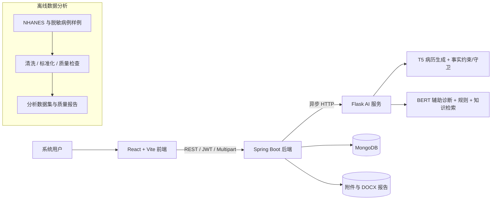

<div align="center">

# 医疗病历生成与分析系统

### Medical Record Generation and Analysis System

一个贯通病例录入、附件解析、AI 辅助分析、结构化病历生成、历史管理与报告下载的应用系统。

[](代码文件/frontend/frontend/package.json)
[](代码文件/backend-service/pom.xml)
[](代码文件/ai-service/requirements.txt)
[](代码文件/backend-service/README.md)
[](代码文件/backend-service/pom.xml)
[](代码文件/ai-service/README.md)

[快速开始](#-快速开始) · [系统架构](#-系统架构) · [功能说明](#-核心功能) · [模块文档](#-模块文档)

</div>

> [!IMPORTANT]
> 本系统仅用于学习研究与辅助信息整理，不构成医疗诊断或治疗建议。请只使用虚构或脱敏病例数据。

## 📖 项目简介

本项目采用 `React → Spring Boot → Flask AI → MongoDB` 的四层架构，将原本分散的患者信息、检查资料和文本描述组织为清晰的病例处理流程。系统支持用户认证、病例提交、异步 AI 分析、附件解析、结果复核、历史检索和 DOCX 报告下载，并提供独立的数据清洗与质量分析流水线。

本地运行默认调用真实 Flask AI 服务；Mock 仅用于显式的离线测试。仓库包含辅助诊断模型、知识索引和脱敏样例；病历生成权重体积较大，不进入 Git，可通过 AI 服务中的数据准备与训练脚本重新生成。

## ✨ 核心功能

| 模块 | 能力 |
| --- | --- |
| 用户与权限 | 注册、登录、JWT 会话、注销失效、病例所有权校验 |
| 病例录入 | 基本信息、主诉、现病史、既往史、体征、辅助检查等结构化字段 |
| 附件处理 | 支持 PDF、DOC、DOCX 文本提取；图片安全保存并明确标记解析状态 |
| 病历生成 | 独立 T5 Transformer 将患者口语、自述与既往诊疗记录转换为精简住院病历；所有展示字段做事实保持的临床书面化，并带事实约束、受约束二次生成和模板兜底 |
| AI 辅助分析 | 症状识别、医学术语抽取、常见病辅助判断与危险信号提示；不覆盖正式病历中的医生输入 |
| 异步任务 | 病例提交后返回任务 ID，可查询分析进度、完成状态和稳定错误码 |
| 结果管理 | 结果查看、历史分页与搜索、人工复核编辑、附件鉴权下载 |
| 报告导出 | 生成包含结构化信息、分析结果和免责声明的 DOCX 报告 |
| 数据流水线 | NHANES 合并、标准化、数据质量检查以及糖尿病、肾功能、心血管分析子集 |

病历文本由独立的 **Randeng-T5 生成模型**处理；辅助诊断则结合监督分类模型、规则层与知识检索层，两者互不覆盖。辅助诊断监督模型覆盖 5 类高质量训练标签，完整规则与检索能力覆盖 20 类常见疾病。正式分类模型为 **BERT 微调 v2.0.0**（IMCS-21 金标 + 远程监督弱标签训练，官方测试集 `macro-F1 = 0.8598`）；早期 TF-IDF+逻辑回归 v1.0.0（`macro-F1 = 0.8491`）经两轮对比实验综合评估后已弃用，仅作无 GPU 环境的自动降级兜底。详细说明见 [AI 模型报告](代码文件/ai-service/model_report.md)、[Transformer 对比实验](代码文件/ai-service/transformer_comparison.md) 及 [数据扩充实验报告](代码文件/ai-service/augmentation_report.md)。

## 🧭 系统架构



在线请求链与离线数据分析模块职责分离：在线系统负责实时病例处理，数据模块负责可复现的数据准备和分析输出。

## 🧰 技术栈

| 层级 | 技术 |
| --- | --- |
| 前端 | React 19、TypeScript、Vite 7、Ant Design、Axios、React Router |
| 后端 | Java 21、Spring Boot 3.5、Spring Security、Spring Data MongoDB、WebClient |
| AI 服务 | Python 3.13、Flask、PyTorch、HuggingFace Transformers（BERT 微调）、scikit-learn、NumPy、joblib |
| 数据处理 | pandas、NHANES 2017–2018 公共健康数据、可复现 Python 脚本 |
| 数据库 | MongoDB Community 8.0 |
| 文档与文件 | Apache POI、PDFBox、DOCX 报告、OpenAPI / Postman |
| 测试 | Vitest、JUnit 5、pytest、真实 HTTP 全链路冒烟测试 |

## 📁 目录结构

```text
Medical-Record-System/
├── README.md
└── 代码文件/
    ├── frontend/frontend/        # React 前端
    ├── backend-service/          # Spring Boot 后端
    ├── ai-service/               # Flask AI 推理服务
    └── data-analysis/            # 数据处理与质量分析
```

## 🚀 快速开始

### 1. 环境要求

- Windows 10/11 与 PowerShell 5.1+
- Java 21
- Python 3.13（建议；依赖版本见各模块 `requirements.txt`）
- Node.js 20.19+ 与 npm
- MongoDB Community 8.0
- 首次安装依赖时需要网络

### 2. 克隆并安装依赖

```powershell
git clone https://github.com/liumumumumu/Medical-Record-System.git
cd Medical-Record-System

python -m pip install -r ".\代码文件\ai-service\requirements.txt"
python -m pip install -r ".\代码文件\ai-service\requirements-generation.txt"
python -m pip install -r ".\代码文件\data-analysis\requirements.txt"

Push-Location ".\代码文件\frontend\frontend"
npm ci
Pop-Location
```

Spring Boot 使用 Maven Wrapper，首次构建时会自动下载 Java 依赖。

### 3. 启动服务

确认 MongoDB 已启动，然后分别打开三个 PowerShell 终端运行：

```powershell
# 终端 1：AI 服务
Set-Location ".\代码文件\ai-service"
python app.py

# 终端 2：后端服务
Set-Location ".\代码文件\backend-service"
.\mvnw.cmd spring-boot:run

# 终端 3：前端服务
Set-Location ".\代码文件\frontend\frontend"
npm run dev
```

默认访问地址：<http://127.0.0.1:5173/>

| 项目 | 默认值 |
| --- | --- |
| 前端 | `http://127.0.0.1:5173` |
| 后端 | `http://127.0.0.1:8080` |
| AI 服务 | `http://127.0.0.1:5000` |
| MongoDB | `mongodb://127.0.0.1:27017/medical_records` |

首次使用时可通过前端注册账号。停止系统时，在三个服务终端中分别按 `Ctrl+C`；MongoDB 系统服务需按本机安装方式单独管理。

## ✅ 测试与验证

各模块可分别运行测试与构建：

```powershell
# AI 服务
Push-Location ".\代码文件\ai-service"
python -m pytest
Pop-Location

# 后端服务
Push-Location ".\代码文件\backend-service"
.\mvnw.cmd test
Pop-Location

# 前端
Push-Location ".\代码文件\frontend\frontend"
npm test
npm run build
Pop-Location

# 数据分析
Push-Location ".\代码文件\data-analysis"
python -m unittest discover tests
Pop-Location
```

## ⚙️ 配置说明

主要配置通过环境变量注入，示例见：

- [后端配置模板](代码文件/backend-service/.env.example)
- [前端配置模板](代码文件/frontend/frontend/.env.example)

## 📚 模块文档

- [AI 服务说明](代码文件/ai-service/README.md)
- [AI 模型报告](代码文件/ai-service/model_report.md)
- [后端服务说明](代码文件/backend-service/README.md)
- [数据分析说明](代码文件/data-analysis/README.md)
- [前端说明](代码文件/frontend/README.md)

## 🔒 数据与安全边界

- 不提交 `.env`、JWT 密钥、运行日志、MongoDB 数据、上传附件或生成报告。
- 大型 `dataset/` 原始研究语料不进入仓库；运行所需模型与脱敏资源已包含。
- 所有病例、附件和报告接口均校验登录用户所有权。
- 图片在未配置 OCR 时只保存并展示元数据，不虚构解析结果。
- 任何公开演示都应使用虚构或充分脱敏的数据。

---

<div align="center">

**仅供学习研究与辅助整理，不替代执业医师判断。**

</div>
