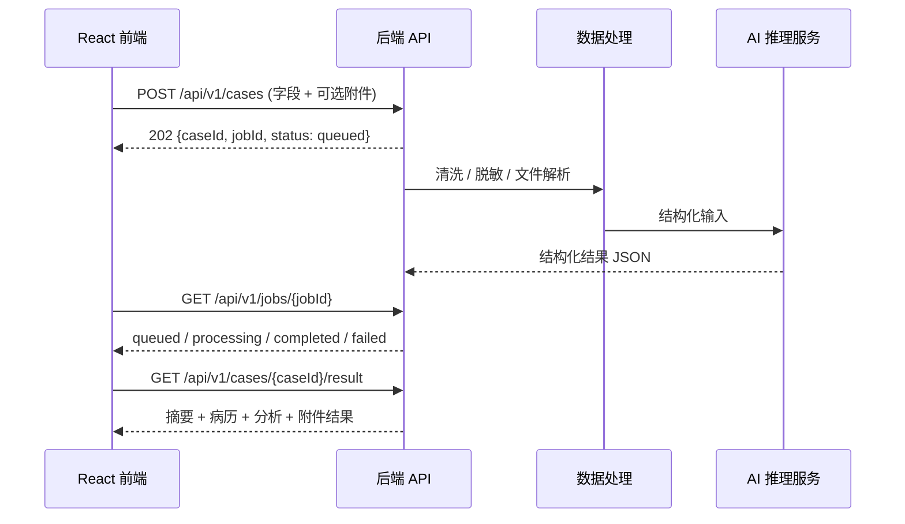

# 前后端与 AI 交接规范

> [!important] 使用范围
> 本文是“医疗病历生成与分析系统”当前前端与后端、数据处理、AI 训练 / 推理同学的联调依据。任何一方修改字段、接口、状态或结果结构前，都要先同步本文和 [[需求规划]]。

## 1. 当前前端已经完成什么

前端当前为 `v0.2 前端流程版`，本地源码位于：`/Users/omar/Documents/大二下小学期`。

- 已完成病例录入页 `/upload`、结果页 `/results` 和未知地址兜底路由。
- 已完成默认四字段录入、展开完整字段、必填校验、年龄 `0-130` 校验、清空、提交中、失败和成功跳转状态。
- 已完成附件选择、生成需求多选、演示登录、头像菜单和退出。
- 已完成“摘要、结构化病历、分析与诊疗信息、检查资料”四区结果阅读页。
- 已完成 `npm run build`，并验证 `/upload`、`/results` 本地路由返回 HTTP 200。

> [!warning] 当前能力边界
> “生成病历并分析”目前只把前端字段保存到浏览器 `sessionStorage` 后跳转结果页；没有调用 Axios、没有后端、没有真实认证、没有真实文件上传、没有真实 AI 推理。课程演示数据必须使用虚构或脱敏内容。

## 2. 当前字段契约

字段配置唯一来源：`src/components/upload/form-config.ts`。后端、数据和 AI 侧不能自行改名；如需改名，应由双方先更新本表。

| 前端 key | 中文字段 | 类型 | 必填 | 前端约束 | 说明 |
| --- | --- | --- | --- | --- | --- |
| `patientName` | 姓名 | string | 是 | 最大 30 字 | 真实环境建议脱敏或使用内部 ID |
| `gender` | 性别 | `male` / `female` | 是 | 枚举 | 后端不得返回中文枚举给请求层 |
| `age` | 年龄 | number | 是 | 0-130，整数 | 单位：岁 |
| `department` | 就诊科室 | enum | 否 | `internal` / `surgery` / `pediatrics` / `emergency` / `other` | 可扩展，但要同步前端选项 |
| `visitDate` | 就诊日期 | `YYYY-MM-DD` | 否 | 日期 | 使用 ISO 日期，不携带本地时区 |
| `chiefComplaint` | 主诉 | string | 是 | 最大 200 字 | 默认首屏展示 |
| `presentIllness` | 现病史 | string | 是 | 最大 1200 字 | 展开后填写 |
| `pastHistory` | 既往病史 | string | 是 | 最大 800 字 | 无内容时可填写“无” |
| `allergyHistory` | 过敏史 | string | 否 | 无 | 允许“无” |
| `vitalSigns` | 生命体征 | string | 否 | 无 | 未来可改为结构化对象 |
| `physicalExam` | 体格检查 | string | 否 | 无 | 未来可改为结构化对象 |
| `auxiliaryExam` | 辅助检查结果 | string | 否 | 无 | 影像、化验等文本摘要 |
| `attachments` | 上传检查资料 | File[] | 否 | PDF / DOC / DOCX / JPG / JPEG / PNG | 当前前端只保留文件名 |
| `preliminaryDiagnosis` | 初步诊断 | string | 否 | 无 | 由人工输入，不是 AI 最终结论 |
| `treatmentTaken` | 已采取治疗 | string | 否 | 无 | 由人工输入 |
| `medicationUsage` | 用药情况 | string | 否 | 无 | 由人工输入 |
| `generationNeeds` | 生成需求 | string[] | 否 | 枚举数组 | `record`、`symptom`、`diagnosis`、`treatment`、`full-report` |

## 3. 推荐联调架构



> [!tip] 为什么建议异步任务
> AI 推理和文件解析的耗时不可预测。创建病例后返回 `jobId`，前端轮询任务状态，完成后再取结果，可以覆盖排队、处理中、失败、重试和长耗时场景。若课程演示后端确认总耗时稳定低于 10 秒，可先实现同步接口，但响应字段仍应保持与下文一致。

## 4. 后端必须交付的接口

以下是推荐接口。最终路径可以调整，但任何调整都要同步前端并给出完整示例。

### 4.1 创建并提交病例

`POST /api/v1/cases`

- Content-Type：无附件时 `application/json`；有附件时 `multipart/form-data`。
- 请求字段：见“当前字段契约”。
- 成功响应：`202 Accepted`。

```json
{
  "caseId": "case_01HXYZ",
  "jobId": "job_01HXYZ",
  "status": "queued",
  "createdAt": "2026-07-10T10:00:00Z"
}
```

### 4.2 查询任务状态

`GET /api/v1/jobs/{jobId}`

```json
{
  "jobId": "job_01HXYZ",
  "caseId": "case_01HXYZ",
  "status": "processing",
  "progress": 45,
  "message": "正在整理病例与检查资料",
  "updatedAt": "2026-07-10T10:00:08Z"
}
```

状态只能使用：`queued`、`processing`、`completed`、`failed`、`cancelled`。`progress` 范围为 `0-100`，未知进度时可返回 `null`。

### 4.3 获取最终结果

`GET /api/v1/cases/{caseId}/result`

```json
{
  "caseId": "case_01HXYZ",
  "generatedAt": "2026-07-10T10:00:18Z",
  "summary": {
    "patientName": "张某",
    "gender": "male",
    "age": 32,
    "department": "internal",
    "visitDate": "2026-07-10",
    "chiefComplaint": "发热、咳嗽 3 天"
  },
  "structuredRecord": {
    "presentIllness": "...",
    "pastHistory": "...",
    "allergyHistory": "无",
    "vitalSigns": "...",
    "physicalExam": "...",
    "auxiliaryExam": "..."
  },
  "analysis": {
    "preliminaryDiagnosis": "...",
    "treatmentTaken": "...",
    "medicationUsage": "...",
    "generationNeeds": ["record", "symptom"],
    "content": "可选的综合分析文本",
    "disclaimer": "仅供辅助整理与课程演示，不替代执业医师判断。"
  },
  "attachments": [
    {
      "id": "file_01",
      "fileName": "blood-test.pdf",
      "mimeType": "application/pdf",
      "url": "https://example.invalid/files/file_01"
    }
  ]
}
```

### 4.4 统一错误格式

所有失败响应必须遵循同一结构，前端依赖 `code` 区分显示方式。

```json
{
  "code": "VALIDATION_ERROR",
  "message": "年龄必须在 0 至 130 之间",
  "fieldErrors": {
    "age": "年龄必须在 0 至 130 之间"
  },
  "requestId": "req_01HXYZ"
}
```

推荐错误码：`VALIDATION_ERROR`、`UNAUTHORIZED`、`FORBIDDEN`、`FILE_TOO_LARGE`、`UNSUPPORTED_FILE_TYPE`、`AI_PROCESSING_FAILED`、`AI_TIMEOUT`、`INTERNAL_ERROR`。

### 4.5 认证接口（第二阶段）

- `POST /api/v1/auth/login`：账号密码换取会话或短期令牌。
- `GET /api/v1/auth/me`：恢复当前用户和权限。
- `POST /api/v1/auth/logout`：注销会话。

认证方案由后端确定，但必须告知前端：凭证放在 HttpOnly Cookie 还是 Authorization Header、刷新机制、过期时间、跨域策略和未登录错误格式。

## 5. 各角色交付清单

### 后端同学

- [ ] 提供 OpenAPI / Apifox / Postman 文档和稳定测试环境地址。
- [ ] 实现病例创建、任务状态、最终结果、文件上传和统一错误格式。
- [ ] 提供请求、成功、字段校验失败、AI 失败、超时、未登录的真实 JSON 示例。
- [ ] 明确文件大小上限、MIME 白名单、存储位置、过期和删除策略。
- [ ] 明确认证方式、CORS、请求头、环境变量名和 API 版本策略。
- [ ] 确保日志不记录完整敏感病历内容；提供 `requestId` 方便排查。

### 数据处理同学

- [ ] 给出输入清洗和字段标准化规则，例如空值、日期、单位、性别枚举和“无”如何处理。
- [ ] 给出附件解析的输入输出规范，区分原始文件、抽取文本、失败原因和置信度。
- [ ] 提供最少 3 份完全脱敏的端到端样例：正常、字段不全、附件解析失败。
- [ ] 确认训练 / 评估 / 演示数据均不包含可识别真实患者的信息。

### AI 训练 / 推理同学

- [ ] 固定模型服务输入 JSON 和输出 JSON，不返回只能展示的自由文本。
- [ ] 输出字段必须能映射到 `summary`、`structuredRecord`、`analysis` 和 `attachments`。
- [ ] 为每条结果提供模型版本、生成时间和必要的失败原因；不要伪造医学确定性。
- [ ] 明确模型超时、限流、空结果、低置信度和拒答时的行为。
- [ ] 在输出中固定保留医学免责声明，课程演示数据不得混入真实隐私信息。

### 前端同学（Omar）

- [ ] 新建 Axios API 层和 TypeScript 请求 / 响应类型。
- [ ] 将当前 `sessionStorage` 演示生成替换为真实 `caseId` / `jobId` 生命周期。
- [ ] 根据后端 `fieldErrors` 映射表单错误，根据任务状态展示排队、处理中、完成、失败和重试。
- [ ] 按真实结果 JSON 映射结果页，不把 AI 原始文本直接塞进页面。
- [ ] 对附件上传、下载权限、超时、断网、刷新恢复和未登录跳转做前端处理。
- [ ] 完成接口联调后再做动画、截图、跨宽度验收与部署。

## 6. 联调前必须确认的决策

| 决策 | 必须由谁确认 | 未确认的后果 |
| --- | --- | --- |
| API 基础地址与版本路径 | 后端 | 前端无法配置环境变量 |
| 同步还是异步生成 | 后端 + AI | 前端无法设计加载和结果跳转 |
| 身份认证方式 | 后端 | 登录演示无法替换为真实会话 |
| 文件上限、类型和上传方式 | 后端 + 数据处理 | 当前前端接受范围可能与服务不一致 |
| AI 输出固定 JSON | AI + 后端 | 结果页需要反复改版或无法稳定渲染 |
| 数据脱敏和保留周期 | 全组 | 课程演示存在隐私风险 |
| 失败、超时和重试策略 | 后端 + AI + 前端 | 演示时会出现无解释的失败 |

## 7. 前端收到交付后的实施顺序

1. **先锁接口契约**：把后端文档、样例 JSON 和字段表逐项对照，不能边猜边接。
2. **建立 API 层**：新增 `src/services/medical-api.ts`、请求与响应类型、环境变量和统一错误处理。
3. **替换演示提交**：`upload-module.tsx` 不再直接写 `sessionStorage`，而是上传并保存 `caseId` / `jobId`。
4. **实现任务生命周期**：轮询或订阅 `queued -> processing -> completed / failed`，支持超时、取消和重试。
5. **映射真实结果**：改造 `results-page.tsx`，以服务端结果为准，并区分“输入信息”“AI 整理结果”“人工诊疗信息”。
6. **接认证与文件**：替换演示登录，处理 Token / Cookie、未登录跳转、文件进度和失败反馈。
7. **完整验收**：测试正常、缺字段、附件不合法、网络中断、AI 超时、刷新、退出登录和无结果访问。
8. **最后做动画**：接口和状态稳定后，统一补页面进入、表单展开、任务进度和结果出现动画。

## 8. 联调验收标准

- [ ] 前端字段与后端字段表完全一致，无临时私有字段。
- [ ] 正常病例可以从录入提交到结果展示。
- [ ] 后端字段校验错误能够显示到对应前端字段。
- [ ] AI 处理中有可理解的状态，不出现页面卡死。
- [ ] AI 失败、超时、空结果和网络错误均有具体提示和可重试路径。
- [ ] 文件类型、大小和上传失败提示与后端策略一致。
- [ ] 刷新结果页后能按 `caseId` 重新获取真实结果。
- [ ] 未登录、登录过期和退出登录符合后端权限规则。
- [ ] 演示数据经过脱敏，页面始终展示免责声明。
- [ ] `npm run build`、目标浏览器和 1280px / 1440px / 1920px 验收通过。

## 9. 联调会议最小议程

1. 逐项确认“当前字段契约”是否有增删改。
2. 确认同步或异步任务模式，以及预期耗时。
3. 现场拿一份脱敏样例跑通请求、状态和结果 JSON。
4. 约定错误码、文件限制、认证和隐私边界。
5. 确认每位同学的交付时间、测试地址和负责人。

## 相关文档

- [[项目总览]]
- [[项目状态]]
- [[需求规划]]
- [[任务中心]]
- [[AI 接手指南]]
- [[问题记录]]

## 更新规则

- 接口、字段、模型输出或权限方案变化时必须更新本文。
- 联调结束后将实际接口示例、已知问题和验证结果回写 [[开发日志]] 与 [[问题记录]]。
