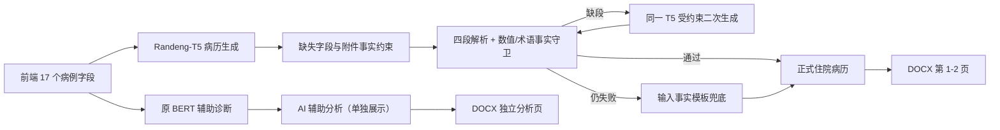

# Transformer 病历生成改造说明

## 1. 改造目标

本次改造把“辅助诊断分类”和“病历文本生成”拆成两个独立任务，以符合任务书中“根据患者基本信息、诊疗/治疗记录生成结构化病历”的要求。



正式病历中的初步诊断、已接受治疗和用药记录只采用前端/医生输入。BERT 的疾病分类结果不再写回或覆盖正式病历，只保留为辅助分析。

## 2. 输出结构

系统输出“精简住院病历”，字段如下：

1. 基本信息（程序按字段确定性组装）
2. 主诉（Transformer 规范化）
3. 现病史（Transformer 规范化）
4. 既往史（Transformer 规范化）
5. 过敏史（程序保守书面化）
6. 生命体征与体格检查（程序保守书面化）
7. 辅助检查（Transformer 规范化）
8. 初步诊断（医生输入，保留事实并书面化）
9. 既往治疗记录（患者已接受，保留事实并书面化）
10. 用药记录（患者已使用，保留事实并书面化）

模型只生成 `<主诉>`、`<现病史>`、`<既往史>`、`<辅助检查>` 四段。缺失字段必须输出“未提供”。

## 3. 数据集与切分

数据脚本：`代码文件/ai-service/scripts/prepare_record_generation_data.py`

输出目录：`dataset/derived/record-generation-v1/`

| 数据来源 | 用途 | 数量/处理 |
| --- | --- | --- |
| IMCS-21 | 金标训练 | 官方 train 2,472 个病例，按双参考展开为 4,944 条 |
| IMCS-21 | 金标验证/测试 | 完整保留官方 dev 833、test 811 个病例 |
| CBLUE IMCS-V2-MRG 镜像 | 金标补充 | 3,000 条候选；清除与验证/测试重复目标后保留 2,461 条 |
| Toyhom Chinese-medical-dialogue-data | 多科室弱标注 | 男科、内科、妇产科、肿瘤科、儿科、外科各抽样 3,000 条，共 18,000 条 |

最终 `gold_train.jsonl` 为 7,405 条，`weak_train.jsonl` 为 17,083 条，`weak_dev.jsonl` 为 917 条。IMCS 官方病例 ID 在 train/dev/test 之间的交集为 0；所有金标均含四个结构标签。

基础训练后，`prepare_record_alignment_data.py` 用原始患者自述和医患对话构造与前端字段同构的输入，并从同一病例的多份参考病历中选择书面化程度最高的一份。部署版训练集为 4,933 个去重 gold 病例，开发集 833 条、独立测试集 811 条；三者整段输入/目标复制数均为 0。另生成 2,658 条只用于专项实验的高质量口语扰动，但该候选在真实 dev 上退化，因此未部署。清单保存在 `alignment_manifest.json`。

数据来源与许可：

- IMCS-21：原仓库未声明许可证，只用于课程研究，不公开再分发数据或训练权重。
- CBLUE 本地镜像：README 声明 Apache-2.0。
- Toyhom 数据：[官方仓库](https://github.com/Toyhom/Chinese-medical-dialogue-data)，MIT；固定提交 `26724a4357fcd142f0cab81188cacf1a2dd8a827`。
- 每个源文件的字节数、SHA-256、过滤统计和许可说明保存在 `manifest.json`，并镜像到 `代码文件/ai-service/artifacts/record-generation-v1/manifest.json`。

Toyhom 的医生回答只作为带警示的上下文，不会被当成“患者已经接受的治疗”。该数据最初构造的目标只是口语摘抄，不能教会口语到书面病历的转换，因此 v1.2.0 的书面化对齐脚本会拒绝 `--weak-per-domain` 非零值；弱标注不进入部署版微调。

## 4. 模型训练

基础模型：[IDEA-CCNL/Randeng-T5-77M-MultiTask-Chinese](https://huggingface.co/IDEA-CCNL/Randeng-T5-77M-MultiTask-Chinese)，固定 revision `06d379d7375245f31cfb87166eff134cfeb5dead`，模型页声明 Apache-2.0。

训练脚本：`代码文件/ai-service/scripts/train_record_generator.py`

主要配置：

- source 最大长度 768，target 最大长度 320
- batch size 2，梯度累积 8（有效 batch 16）
- 学习率 `3e-5`，warmup 10%，seed 42
- 弱标注阶段 1 epoch，金标阶段最多 5 epoch
- 官方 dev ROUGE-L 早停，patience 2
- 训练、离线评估与生产推理 beam size 均为 4；输出再经过原始事实锚定和安全守卫
- RTX 4070 使用 BF16；FP16 在长样本压力测试中出现溢出，因此改用具有 FP32 指数范围的 BF16，并在训练指标中如实记录

基础两阶段训练实测于 RTX 4070 Laptop GPU，弱标 1 epoch + 金标 3 epoch 后因 patience 2 早停，最佳权重来自金标第 1 epoch；总墙钟时间 83 分 38 秒，最佳 dev ROUGE-L 为 0.6250。

旧版曾进行四轮结构对齐，但脚本错误地把参考病历段落反填为输入字段，把任务训练成恒等复制，0.998 的 ROUGE-L 因而失真。v1.2.0 删除该流程，重新从原始患者自述/问诊对话构造输入：

| 候选 | 训练输入 | 条数 | 学习率 | 真实 dev ROUGE-L | 结论 |
| --- | --- | ---: | ---: | ---: | --- |
| formal-v2（部署） | 原始患者自述/医患对话 | 4,933 | `1e-5` | 0.5474 | 真实对话指标最好 |
| oral-specialized-v3 | 目标的训练专用口语扰动 | 4,852 | `5e-6` | 0.4900 | 退化，拒绝部署 |
| oral-specialized-v4 | 高书面质量子集口语扰动 | 2,658 × 2 epoch | `3e-6` | 0.4608 | 继续退化，拒绝部署 |

运行命令（从基础权重复现最终权重）：

```powershell
cd "D:\医疗病历生成与分析系统\代码文件\ai-service"
python -m pip install -r requirements-generation.txt
python scripts/prepare_record_generation_data.py
python scripts/train_record_generator.py
python scripts/prepare_record_alignment_data.py
python scripts/align_record_generator.py --base-dir models/record_generator_v1 --output-dir models/record_generator_formal_v2 --train-file alignment_real_train.jsonl --learning-rate 1e-5
$env:RECORD_GENERATOR_MODEL_DIR = (Resolve-Path models/record_generator_formal_v2).Path
python scripts/evaluate_record_generator.py --model-dir models/record_generator_formal_v2 --data-file ../../dataset/derived/record-generation-v1/alignment_test.jsonl --batch-size 8
python scripts/evaluate_oral_formalization.py
```

候选权重通过独立 test 与短口语运行时验收后，才把模型、tokenizer 和 metadata 提升到 `代码文件/ai-service/models/record_generator_v1/`，并从正式目录再跑一次评估与验收。模型目录约数百 MB，已从 Git 排除；可提交的数据清单和指标保存在 `代码文件/ai-service/artifacts/record-generation-v1/`。

## 5. 推理安全与兜底

运行时实现位于 `代码文件/ai-service/src/record_generator.py`：

- `TransformerRecordGenerator`：加载本地 T5 权重并生成四段标签文本；SentencePiece 的 `<0xHH>` 字节标记会在校验前还原，温度单位统一为 `℃`，避免把解码标记误判为新增数值。
- `normalize_missing_source_sections`：输入明确缺失的字段强制归一为“未提供”；附件解析原文属于权威输入，若模型摘要遗漏则原样补入辅助检查，并在元数据中记录警告。
- `normalize_record_fields`：对过敏史、生命体征、体格检查、医生诊断、已接受治疗和用药记录做确定性书面化，例如“没发现药物过敏”改为“否认药物过敏史”、“吃过蒙脱石散”改为“曾服用蒙脱石散”；只改写表达，不新增事实。
- `RecordGuard`：检查四段完整性、输入中不存在的新数值、新疾病/药物术语、缺失项补写和主诉/现病史锚点。
- 受约束二次生成：首次输出漏段时，把安全的前序字段作为 decoder prefix 交给同一个 T5 续写；二次输出仍不合格才进入完整模板兜底。
- `RecordAssembler`：把模型四段与书面化后的权威输入字段组装为十段正式病历。
- `TemplateRecordGenerator`：模型缺失、推理异常、解析失败或事实守卫失败时，使用输入事实安全兜底。

环境变量：

| 变量 | 值 | 说明 |
| --- | --- | --- |
| `RECORD_GENERATOR_BACKEND` | `auto` / `transformer` / `template` | 选择生成后端 |
| `REQUIRE_RECORD_GENERATOR` | `true` / `false` | 为 true 时，Transformer 未就绪会阻止服务启动 |
| `RECORD_GENERATOR_MODEL_DIR` | 路径 | 覆盖本地模型目录 |
| `RECORD_GENERATOR_BEAMS` | `1` 至 `8` | 生产解码束数，默认 4；课程演示的字段整理任务无需随机采样 |

根目录 `scripts/start-all.ps1` 默认要求真实 Transformer；只有显式传入 `-AllowRecordTemplateFallback` 才允许模板启动。

## 6. API 与前端

原 `generatedRecord: string` 保持不变，新增：

```json
{
  "recordGeneration": {
    "backend": "transformer",
    "modelName": "IDEA-CCNL/Randeng-T5-77M-MultiTask-Chinese",
    "modelVersion": "record-gen-t5-v1.2.0",
    "fallbackUsed": false,
    "warnings": []
  },
  "formalizedInput": {
    "chiefComplaint": "腹痛伴腹泻2天",
    "presentIllness": "患者于2天前晚间进食烧烤后……",
    "allergyHistory": "否认药物过敏史",
    "vitalSigns": "T 36.8℃，P 78次/分",
    "treatmentTaken": "曾于门诊接受补液治疗1次",
    "medicationUsage": "曾服用蒙脱石散"
  }
}
```

`GET /health` 新增 `recordGeneratorLoaded`、`recordGeneratorBackend`、`recordGeneratorVersion`。Spring Boot 将 `recordGeneration` 和 `formalizedInput` 连同病例结果写入 MongoDB；结果页摘要与结构化字段优先显示正式化值，原始输入仍保存在 `patientInput` 供追溯。旧病例缺少新字段时自动回退到原输入，无需迁移。前端结果页显示“Transformer 生成”“模板安全兜底”或“生成方式未知”徽标和警告，同时保留人工编辑能力。

## 7. DOCX

报告采用 `standard_business_brief` 设计令牌和 `memo_masthead` 标题区：Letter 页面、四边 1 英寸边距、固定 9360 DXA 患者信息表、宋体中文覆盖。正式病历在前，空白医生签名位于病历末尾；AI 辅助分析强制另起一页；人工 `editedRecord` 优先于生成文本。

代表性 DOCX 样例位于 `代码文件/ai-service/artifacts/record-generation-v1/`。样例已通过 LibreOffice 转 PDF、Poppler 逐页栅格化并人工检查 3 页，无裁切或重叠；渲染中间文件不纳入仓库。自动测试同时断言页面尺寸、边距、表格宽度和表格缩进。

## 8. 验收指标

训练完成后生成：

- `training_metrics.json`：训练损失、每轮 dev 指标与最佳轮次
- `test_metrics.json`：未触碰 test 的 BLEU-2/4、ROUGE-1/2/L、解析率、段落完整率、数值一致率、疾病/药物术语一致率
- `oral_formalization_metrics.json`：胃肠、呼吸、神经、泌尿、儿科 5 组短口语；必需事实、口语残留、Transformer/兜底路径
- `output/e2e/oral-formalization.json`：真实 Flask → Spring Boot → MongoDB → DOCX 链路；检查摘要、6 个结构化字段、完整正文和报告文本

目标阈值为 ROUGE-L ≥ 0.45、BLEU-2 ≥ 0.45、四段解析率 ≥ 98%、数值一致率 ≥ 99%、疾病/药物术语一致率 ≥ 90%、权威诊断/治疗/用药字段匹配率 100%、预热 GPU P95 ≤ 3 秒。指标未达到时应如实报告，不得把模板兜底结果宣称为 Transformer 生成。

最终 `record-gen-t5-v1.2.0` 的正式结果：

| 验收集 | BLEU-2 | BLEU-4 | ROUGE-L | 四段解析/完整 | 数值一致 | 关键术语一致 |
| --- | ---: | ---: | ---: | ---: | ---: | ---: |
| 真实对话同构、未参与训练的 `alignment_test`（811 条） | 0.3990 | 0.3207 | 0.5357 | 100% / 100% | 98.40% | 94.70% |

BLEU-2 与数值一致率未达到原定 0.45/99% 门槛，不能写成“全部指标通过”；运行时数值守卫会拒绝输出新增数值。5 组短口语运行时验收全部通过：Transformer 路径 5/5、完整模板兜底 0、必需事实遗漏 0、指定口语残留 0。真实口语 HTTP 端到端验收中，摘要与 6 个结构化字段不一致 0、完整正文事实遗漏 0、口语残留 0、DOCX 缺失 0；另一个通用 E2E 测试覆盖附件解析、MongoDB 持久化、人工编辑和 DOCX 下载。

v1.2.0 的运行时采用“Transformer 四段生成 + 全字段临床书面化 + 原始事实锚定 + 安全守卫”。既往史、辅助检查和附件数值以用户输入为权威；诊断、已接受治疗和用药记录由程序保留事实并书面化后组装。该指标只衡量课程数据上的文本转换与事实一致性，不代表临床有效性。
